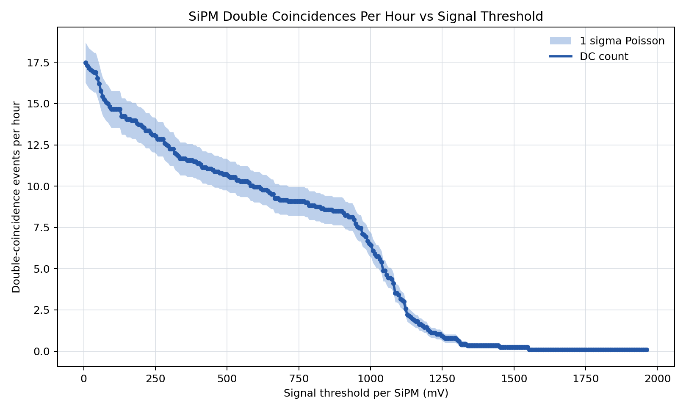

# Dilution Detector Plot Development Report

Date: 2026-07-17

This note records the analysis workflow used to count SiPM double coincidences
from the 10 million CRY muon run, then develop the photon-threshold plots.

## Input Run

The analysis used the completed CRY run:

```text
runs/cry_10M_live_20260717_152927
```

The hit ntuple files are:

```text
runs/cry_10M_live_20260717_152927/work/output/MUON-run0_nt_hits_t*.csv
```

The run contains 8 hit CSV shards. The analysis scanned 4,238,163 hit rows.

The two SiPMs are identified by copy number:

```text
SiPM copy 0: lower SiPM
SiPM copy 1: upper SiPM
```

## Double-Coincidence Definition

A double coincidence, or DC, is one `EventID` where both SiPMs record at least
the selected number of optical photons.

The initial definition used a non-zero threshold:

```text
SiPM copy 0 photons >= 1
SiPM copy 1 photons >= 1
```

The counting script is:

```text
analysis/dilution_detector/count_sipm_double_coincidences.py
```

It streams the Geant4 CSV files, filters for:

```text
Particle == opticalphoton
Volume contains sipm
Copynumber in 0,1
```

Then it builds per-event photon counts for the two SiPMs.

## Baseline Counts

For the 10M run, the raw non-zero double-coincidence result was:

```text
Events with any SiPM photon: 2166
SiPM copy 0 photon rows: 1,563,348
SiPM copy 1 photon rows: 1,879,097
SiPM copy 0 events with photons: 1442
SiPM copy 1 events with photons: 1494
Raw non-zero double coincidences: 770
```

The per-event count table generated for plotting is:

```text
analysis/dilution_detector/results/cry_10M_sipm_counts_by_event.csv
```

## 80-Photon Threshold

The next step was to require at least 80 photons in each SiPM:

```text
SiPM copy 0 photons >= 80
SiPM copy 1 photons >= 80
```

This reduced the double-coincidence count to:

```text
Double coincidences with >=80 photons in each SiPM: 193
```

The generated CSV outputs are:

```text
analysis/dilution_detector/results/cry_10M_double_events_cut80.csv
analysis/dilution_detector/results/cry_10M_sipm_counts_by_event_cut80.csv
```

The script was also run with `--unique-tracks`; the result stayed at 193, so
the threshold count is not inflated by repeated rows from the same photon track.

## SiPM Efficiency Step

The SiPM efficiency was then incorporated as 40%.

If the desired threshold is 80 detected photons after 40% efficiency, the
equivalent incident-photon threshold is:

```text
80 / 0.40 = 200 photons
```

The script supports this directly:

```text
--sipm-efficiency 0.40
--min-detected-photons-per-sipm 80
```

This applies:

```text
SiPM copy 0 photons >= 200
SiPM copy 1 photons >= 200
```

The result was:

```text
Double coincidences with 40% efficiency and 80 detected photons required: 171
```

The generated CSV outputs are:

```text
analysis/dilution_detector/results/cry_10M_double_events_eff40_cut80det.csv
analysis/dilution_detector/results/cry_10M_sipm_counts_by_event_eff40_cut80det.csv
```

Again, the `--unique-tracks` check gave the same result, 171.

## Event Counts By Threshold

The event counts in each SiPM were checked at the main thresholds:

| Threshold per SiPM | SiPM copy 0 events | SiPM copy 1 events | Both SiPMs |
| ---: | ---: | ---: | ---: |
| >= 1 photon | 1442 | 1494 | 770 |
| >= 80 photons | 1071 | 1210 | 193 |
| >= 200 photons | 932 | 1093 | 171 |

## Threshold Scan Plot

A plotting workflow was added:

```text
analysis/dilution_detector/plot_double_coincidence_threshold_scan.py
```

It reads:

```text
analysis/dilution_detector/results/cry_10M_sipm_counts_by_event.csv
```

Then it scans photon thresholds in 10-photon steps. For each threshold, it
counts events satisfying:

```text
SiPM copy 0 photons >= threshold
SiPM copy 1 photons >= threshold
```

The first development plot used photon threshold directly on the x-axis and
full-run double-coincidence counts on the y-axis. That intermediate PNG is not
kept in Git; it can be regenerated with the commands below.

Important points from the threshold scan:

| Photon threshold per SiPM | Double-coincidence events |
| ---: | ---: |
| 10 | 204 |
| 80 | 193 |
| 200 | 171 |

## Time Scaling To Events Per Hour

Using the muon clock, the 10M run was estimated to represent approximately:

```text
700 minutes = 11.6667 hours
```

The per-hour scaling factor is:

```text
60 / 700 = 0.0857142857
```

This converts the full-run DC counts into rates:

```text
DC per hour = DC count * 60 / 700
```

The second development plot kept the photon-threshold x-axis but scaled the
y-axis to double-coincidence events per hour. That intermediate PNG is also not
kept in Git; it is documented here so the development path remains readable.

Important per-hour points:

| Photon threshold per SiPM | DC events | DC events per hour |
| ---: | ---: | ---: |
| 10 | 204 | 17.49 |
| 80 | 193 | 16.54 |
| 200 | 171 | 14.66 |

## 1 Sigma Region

The final plot includes a 1 sigma uncertainty region with alpha 0.5.

The uncertainty model is Poisson counting uncertainty:

```text
sigma_count = sqrt(N)
sigma_per_hour = sqrt(N) * 60 / 700
```

The shaded band is therefore:

```text
rate +/- sigma_per_hour
```

The per-hour uncertainty plot originally included red dashed guides at 80 and
200 photons. Those threshold guides were later removed when the x-axis was
converted to signal threshold.

The final committed plot includes:

```text
blue line: double-coincidence rate per hour
blue shaded region: 1 sigma Poisson band
no vertical threshold guides
```

## Signal-Threshold X-Axis

The final plot converts photon threshold into an expected signal threshold in
millivolts using:

```text
signal threshold = photons * SiPM efficiency * mV per detected photon
signal threshold = photons * 0.40 * 1.5 mV
signal threshold = photons * 0.6 mV
```

The final committed plot is:



Reference conversions:

| Photon threshold per SiPM | Signal threshold per SiPM |
| ---: | ---: |
| 80 | 48 mV |
| 200 | 120 mV |

## Muon Clock Check

The muon clock detected the following muons and antimuons in the 10M run:

| Particle | Rows in muon clock | Unique events |
| --- | ---: | ---: |
| mu- | 33,957 | 33,956 |
| mu+ | 36,330 | 36,329 |
| Total mu-/mu+ | 70,287 | 70,279 |

These counts were used as context for the approximate 700 minute run-duration
estimate.

## Reproduction Commands

Raw non-zero double coincidences:

```sh
python3 analysis/dilution_detector/count_sipm_double_coincidences.py \
  runs/cry_10M_live_20260717_152927 \
  --output analysis/dilution_detector/results/cry_10M_sipm_counts_by_event.csv \
  --double-events-output analysis/dilution_detector/results/cry_10M_double_events.csv
```

80-photon cut:

```sh
python3 analysis/dilution_detector/count_sipm_double_coincidences.py \
  runs/cry_10M_live_20260717_152927 \
  --min-photons-per-sipm 80 \
  --output analysis/dilution_detector/results/cry_10M_sipm_counts_by_event_cut80.csv \
  --double-events-output analysis/dilution_detector/results/cry_10M_double_events_cut80.csv
```

40% efficiency with 80 detected photons required:

```sh
python3 analysis/dilution_detector/count_sipm_double_coincidences.py \
  runs/cry_10M_live_20260717_152927 \
  --sipm-efficiency 0.40 \
  --min-detected-photons-per-sipm 80 \
  --output analysis/dilution_detector/results/cry_10M_sipm_counts_by_event_eff40_cut80det.csv \
  --double-events-output analysis/dilution_detector/results/cry_10M_double_events_eff40_cut80det.csv
```

Threshold scan in full-run counts:

```sh
python3 analysis/dilution_detector/plot_double_coincidence_threshold_scan.py \
  analysis/dilution_detector/results/cry_10M_sipm_counts_by_event.csv \
  --step 10 \
  --mark-threshold 80 \
  --mark-threshold 200
```

Threshold scan scaled to events per hour with 1 sigma band:

```sh
python3 analysis/dilution_detector/plot_double_coincidence_threshold_scan.py \
  analysis/dilution_detector/results/cry_10M_sipm_counts_by_event.csv \
  --step 10 \
  --duration-minutes 700 \
  --mark-threshold 80 \
  --mark-threshold 200 \
  --output-csv analysis/dilution_detector/results/cry_10M_double_coincidence_threshold_scan_per_hour.csv \
  --output-plot analysis/dilution_detector/results/cry_10M_double_coincidence_threshold_scan_per_hour.png
```

Final signal-threshold plot, scaled to events per hour with 1 sigma band:

```sh
python3 analysis/dilution_detector/plot_double_coincidence_threshold_scan.py \
  analysis/dilution_detector/results/cry_10M_sipm_counts_by_event.csv \
  --step 10 \
  --duration-minutes 700 \
  --x-efficiency 0.40 \
  --mv-per-detected-photon 1.5 \
  --output-csv analysis/dilution_detector/results/cry_10M_double_coincidence_signal_threshold_scan_per_hour.csv \
  --output-plot analysis/dilution_detector/results/cry_10M_double_coincidence_signal_threshold_scan_per_hour.png
```

## Output Files

Main scripts:

```text
analysis/dilution_detector/count_sipm_double_coincidences.py
analysis/dilution_detector/plot_double_coincidence_threshold_scan.py
```

Committed plot:

```text
analysis/dilution_detector/results/cry_10M_double_coincidence_signal_threshold_scan_per_hour.png
```

Generated data products are intentionally ignored by Git, except for the final
PNG above. They can be reproduced from:

```text
analysis/dilution_detector/results/cry_10M_sipm_counts_by_event.csv
analysis/dilution_detector/results/cry_10M_double_coincidence_signal_threshold_scan_per_hour.csv
```
