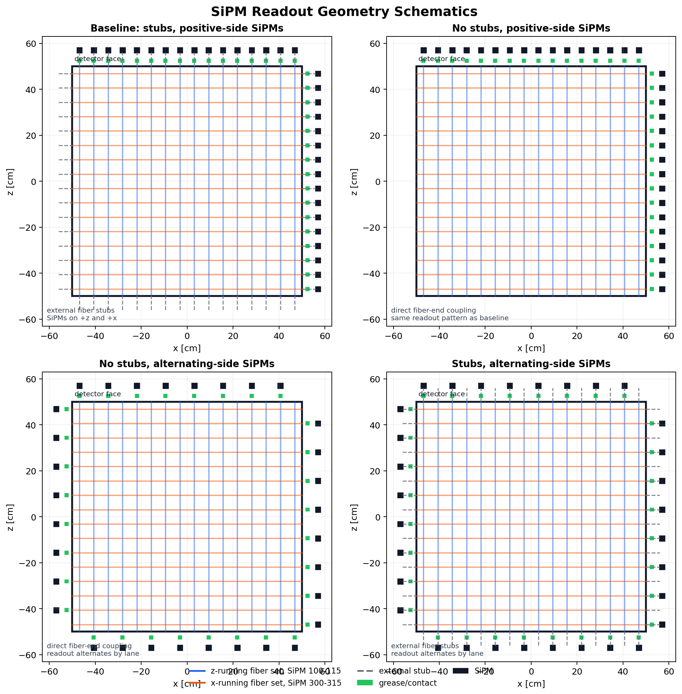
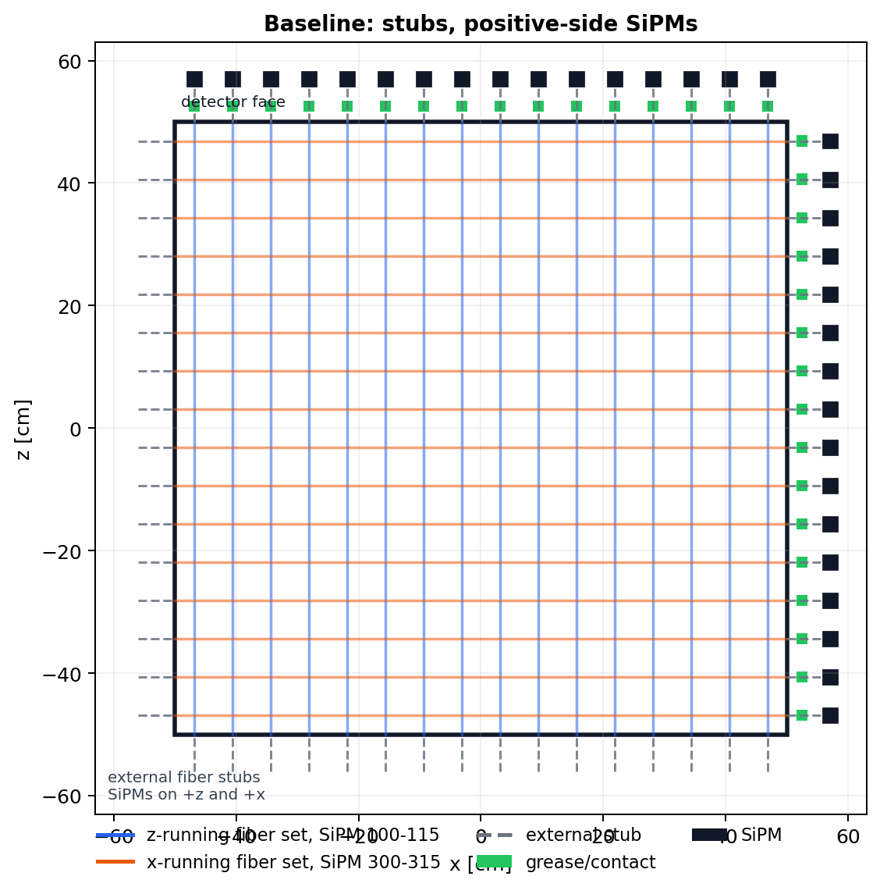
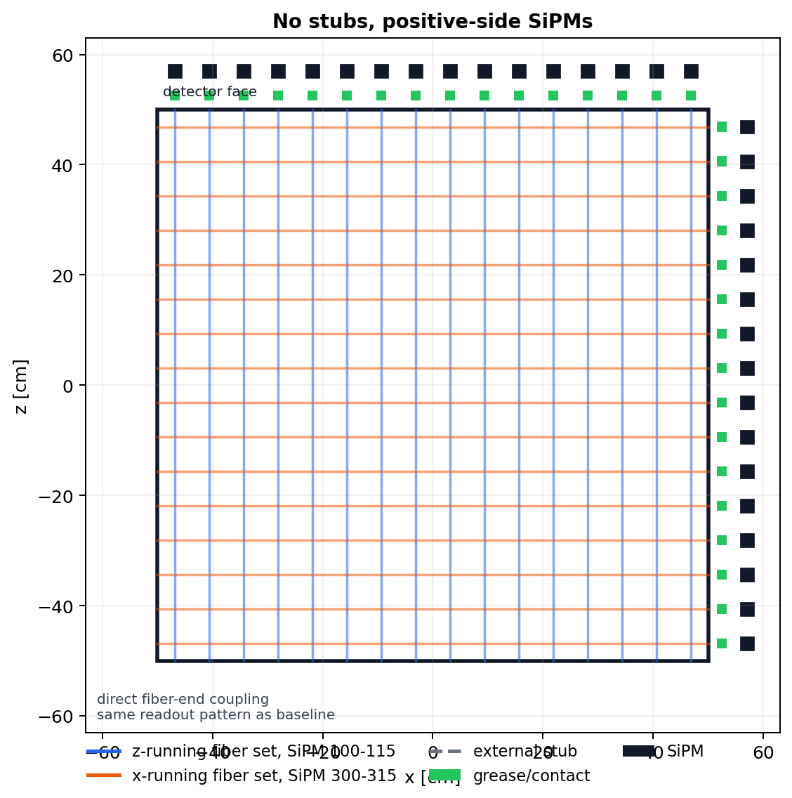
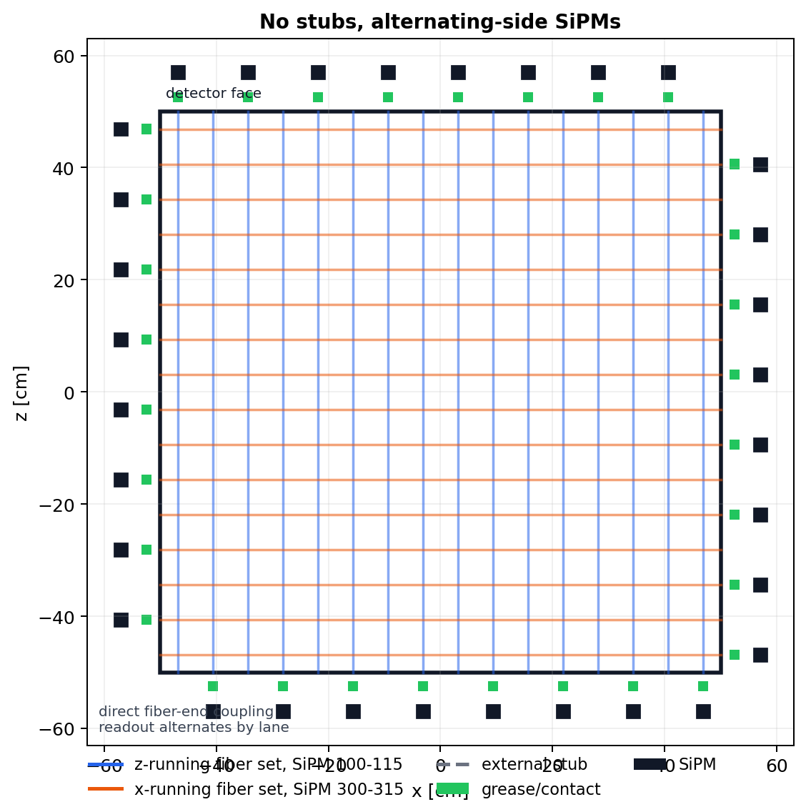
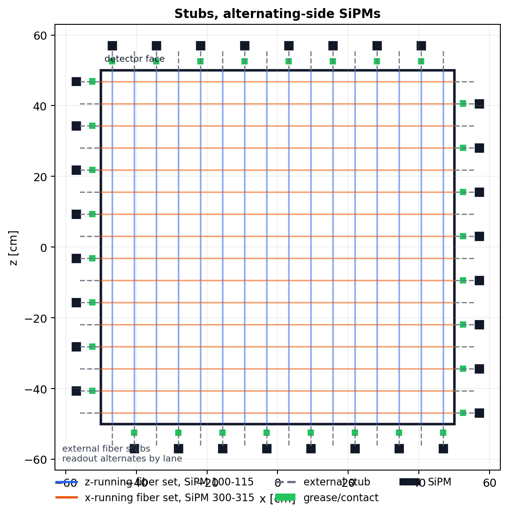
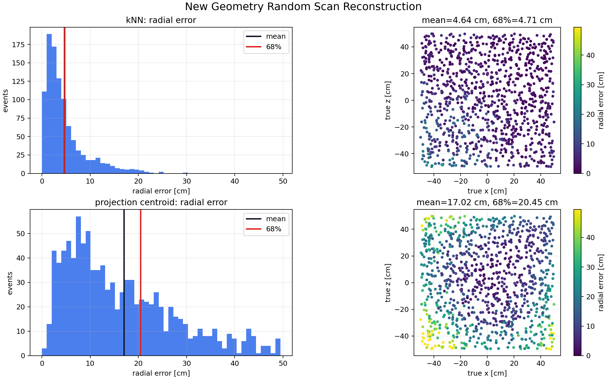
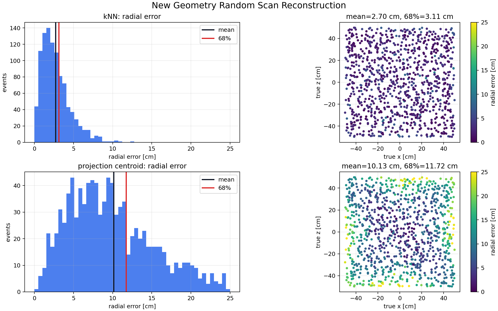
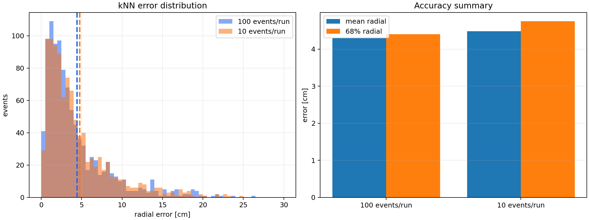
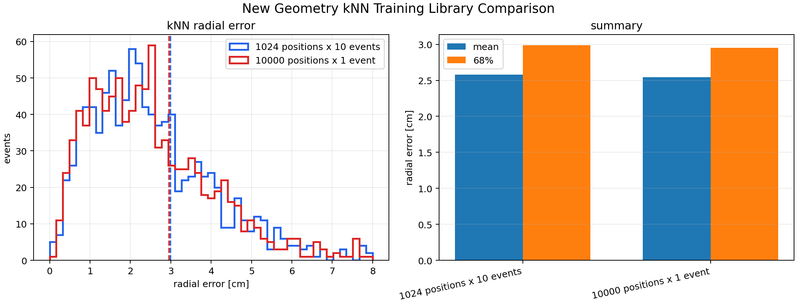

# SiPM Muon Position Reconstruction Logbook

## Table of Contents

- [Purpose](#purpose)
- [Detector Readout Geometries](#detector-readout-geometries)
- [Simulation Samples](#simulation-samples)
- [Reconstruction Inputs](#reconstruction-inputs)
- [Methods](#methods)
- [Results](#results)
- [Design Interpretation](#design-interpretation)
- [Conclusions](#conclusions)
- [Data Provenance](#data-provenance)
- [Appendix: Training Statistics Checks](#appendix-training-statistics-checks)
- [Packaged Artifacts](#packaged-artifacts)

## Purpose

The goal of this study is to reconstruct the transverse muon hit position in the detector from the 32 SiPM count pattern produced by a single simulated muon. The target comparison point is the existing simple SiPM-weighting estimate, which gives roughly 2 cm one-sigma position deviation on a single hit.

The central design question became:

```text
Does the reconstruction improve because we remove fiber stubs,
or because we change the SiPM readout pattern?
```

To answer that, four geometries are compared in a controlled order:

1. Baseline geometry with stubs and all SiPMs on positive sides.
2. No-stub geometry with the same positive-side SiPM pattern.
3. No-stub geometry with alternating SiPM sides.
4. Stubbed geometry with alternating SiPM sides.

## Detector Readout Geometries

Each event is represented by 32 SiPM channels:

- `sipm_100` to `sipm_115`: one fiber family.
- `sipm_300` to `sipm_315`: the orthogonal fiber family.

The schematics below are top views in the detector x-z plane. Blue lines are the z-running fiber family, orange lines are the x-running fiber family, black squares are SiPMs, green squares are grease/contact regions, and dashed gray extensions are external fiber stubs.



### Geometry A: Baseline Stubs, Positive-Side SiPMs

- Geometry ID: `geom-final-stubs-pos`
- GDML: `geometry/final.gdml`
- Stub state: external fiber stubs present.
- Readout pattern: all SiPMs on positive detector sides.
- `sipm_100` to `sipm_115`: read out on `+z`.
- `sipm_300` to `sipm_315`: read out on `+x`.
- Reason for testing: this is the original reference geometry.



### Geometry B: No Stubs, Positive-Side SiPMs

- Geometry ID: `geom-nostubs-pos`
- GDML: `geometry/final_no_stubs_pos_sipms.gdml`
- Stub state: no external fiber stubs.
- Readout pattern: all SiPMs still on positive detector sides.
- `sipm_100` to `sipm_115`: read out on `+z`.
- `sipm_300` to `sipm_315`: read out on `+x`.
- Reason for testing: isolates the effect of removing stubs while keeping the old readout pattern.



### Geometry C: No Stubs, Alternating-Side SiPMs

- Geometry ID: `geom-nostubs-alt`
- GDML: `geometry/final_no_stubs.gdml`
- Stub state: no external fiber stubs.
- Readout pattern: SiPM side alternates lane-by-lane.
- `sipm_100` to `sipm_115`: readout alternates between `+z` and `-z`.
- `sipm_300` to `sipm_315`: readout alternates between `+x` and `-x`.
- Reason for testing: gives the same number of SiPMs but changes the spatial information content of the 32-channel pattern.



### Geometry D: Stubs, Alternating-Side SiPMs

- Geometry ID: `geom-stubs-alt`
- GDML: `geometry/final_stubs_alternating.gdml`
- Stub state: external coated fiber stubs present.
- Readout pattern: SiPM side alternates lane-by-lane.
- Readout ends use `geometry/fiber_kuraray_stub.gdml`, the coated stub with an open readout face.
- Opposite ends use `geometry/fiber_kuraray_stub_capped.gdml`, the coated stub with a mirrored outer cap.
- Reason for testing: isolates whether the alternating readout pattern remains useful when the original stub optics are restored.



## Simulation Samples

The simulations are Geant4 single-muon scans. Two types of samples are used:

- Fixed-position training scans: muons are generated at known grid positions.
- Random-position test scans: muons are generated at random positions not restricted to the training grid.

For newer `ADD_SCAN` runs, one Geant4 run can contain many source positions. The event label is taken from the source-truth ntuple:

```text
EventID -> SourceIndex -> generated source position
SourceCycle -> repeated pass through the source-position table
```

This is preferred over inferring labels from thread-split output filenames.

## Reconstruction Inputs

The raw Geant4 hit ntuples are converted into one compact event vector:

```text
[sipm_100, ..., sipm_115, sipm_300, ..., sipm_315]
```

Each value is the number of unique `OpWLS` photon tracks detected by that SiPM in that event.

The conversion scripts are:

- `scripts/unique_wls_sipm_counts_pipeline.py`
- `scripts/prepare_random_test_scan_data.py`
- `scripts/prepare_add_scan_test_data.py`

The converted per-event CSVs are generated data products and are kept outside Git. Compact summaries, figures, and metadata files are kept in this report package.

## Methods

### kNN Event Library

k-nearest neighbors treats each event as a point in 32-dimensional SiPM-count space. For a test event:

1. Build its 32-channel SiPM count vector.
2. Compare it to the training event library.
3. Find the closest training examples.
4. Predict the hit position from the known positions of those neighbors.

The best settings varied slightly by geometry, but the useful configurations were all event-library kNN models using Euclidean distance with either raw, square-root, or L1-normalized counts. Inverse or inverse-square distance weighting generally helped.

### Projection Centroid

The projection centroid is a transparent baseline, not a trained model. It treats the two SiPM families as independent 1D projections:

```text
predicted coordinate = sum(sipm_position * sipm_count) / sum(sipm_count)
```

This is useful as a sanity check, but it compresses the full 32-channel light pattern into two weighted averages and cannot represent nonlinear light-sharing patterns well.

## Results

All quoted test results below use 1000 random single-muon test events.

### Main Geometry Comparison

| Geometry | Stub state | SiPM pattern | Training library | Best kNN setting | kNN mean radial error | kNN median radial error | kNN 68% radial error | kNN 95% radial error |
|---|---|---|---|---|---:|---:|---:|---:|
| `geom-final-stubs-pos` | stubs present | positive sides only | 1024 positions x 100 events | k=48, euclidean, raw counts, inverse-square | 4.30 cm | 2.87 cm | 4.40 cm | 13.73 cm |
| `geom-nostubs-pos` | no stubs | positive sides only | 1024 positions x 10 events | k=12, euclidean, sqrt counts, inverse-square | 4.64 cm | 3.22 cm | 4.71 cm | 14.12 cm |
| `geom-nostubs-alt` | no stubs | alternating sides | 1024 positions x 10 events | k=12, euclidean, L1 counts, inverse-square | 2.58 cm | 2.25 cm | 2.99 cm | 5.60 cm |
| `geom-stubs-alt` | stubs present | alternating sides | 1024 positions x 10 events | k=12, euclidean, L1 counts, inverse-square | 2.70 cm | 2.35 cm | 3.11 cm | 6.24 cm |

The key comparisons are Geometry A versus Geometry D, and Geometry B versus Geometry C. In both pairs, the alternating readout pattern improves reconstruction substantially. Comparing Geometry C and Geometry D suggests that restoring stubs slightly worsens the alternating-readout performance, but the effect is much smaller than the effect of changing the readout pattern.

### Baseline: Stubs, Positive-Side SiPMs

| Method | Mean radial error | Median radial error | 68% radial error | 95% radial error | sigma x | sigma z |
|---|---:|---:|---:|---:|---:|---:|
| kNN event library | 4.30 cm | 2.87 cm | 4.40 cm | 13.73 cm | 4.13 cm | 4.38 cm |
| Projection centroid | 16.24 cm | 12.96 cm | 19.09 cm | 41.50 cm | 14.22 cm | 14.56 cm |


### No Stubs, Positive-Side SiPMs

| Method | Mean radial error | Median radial error | 68% radial error | 95% radial error | sigma x | sigma z |
|---|---:|---:|---:|---:|---:|---:|
| kNN event library | 4.64 cm | 3.22 cm | 4.71 cm | 14.12 cm | 4.53 cm | 4.46 cm |
| Projection centroid | 17.02 cm | 13.47 cm | 20.45 cm | 42.98 cm | 14.98 cm | 14.95 cm |



### No Stubs, Alternating-Side SiPMs

| Method | Mean radial error | Median radial error | 68% radial error | 95% radial error | sigma x | sigma z |
|---|---:|---:|---:|---:|---:|---:|
| kNN event library | 2.58 cm | 2.25 cm | 2.99 cm | 5.60 cm | 2.09 cm | 2.21 cm |
| Projection centroid | 10.61 cm | 9.62 cm | 12.66 cm | 22.04 cm | 8.70 cm | 8.55 cm |


### Stubs, Alternating-Side SiPMs

| Method | Mean radial error | Median radial error | 68% radial error | 95% radial error | sigma x | sigma z |
|---|---:|---:|---:|---:|---:|---:|
| kNN event library | 2.70 cm | 2.35 cm | 3.11 cm | 6.24 cm | 2.26 cm | 2.35 cm |
| Projection centroid | 10.13 cm | 9.17 cm | 11.72 cm | 21.47 cm | 8.23 cm | 8.33 cm |



## Design Interpretation

### What Removing Stubs Did

Removing stubs while keeping all SiPMs on positive sides did not improve the reconstruction. The kNN 68% radial error changed from 4.40 cm in the baseline to 4.71 cm in the no-stubs positive-side geometry. That is not an improvement and is within the range where differences in training statistics and geometry details matter.

This suggests that the stubs themselves are not the main limitation for the 32-channel reconstruction.

### What Alternating SiPM Sides Did

The alternating readout pattern changed the information content of the event vector. Instead of every channel being read out from the same side of each fiber family, neighboring lanes are read out from opposite ends.

This appears to reduce degeneracy in the SiPM pattern. The kNN 68% radial error improved from 4.71 cm in the no-stubs positive-side geometry to 2.99 cm in the no-stubs alternating geometry. The 95% radial error improved from 14.12 cm to 5.60 cm.

The alternating pattern therefore looks like the main reason for the improved reconstruction.

### What Keeping Stubs With Alternating Readout Did

The stubbed alternating geometry tests the opposite control case: keep the stubs, but change the readout pattern. It gives 3.11 cm 68% radial error, much better than the stubbed positive-side baseline at 4.40 cm.

That reinforces the same conclusion: the readout pattern is the dominant improvement. However, the stubbed alternating result is slightly worse than the no-stubs alternating result, 3.11 cm versus 2.99 cm at 68% radial error. This suggests that stubs are not beneficial for reconstruction in this configuration, although the difference is modest compared with the positive-side versus alternating-side change.

### Why kNN Beats Centroid

The centroid assumes a simple monotonic mapping between count-weighted SiPM position and hit position. That assumption is too simple for these simulations. kNN keeps the full 32-channel pattern and compares it to simulated examples, so it can use asymmetric light sharing, edge behavior, and nonlinear detector response.

Centroid remains useful as a baseline and sanity check, but it is not competitive here.

## Conclusions

1. kNN on the full 32-channel SiPM event vector is consistently better than projection centroid.
2. Removing stubs alone does not explain the reconstruction improvement.
3. Alternating SiPM sides gives a large improvement in single-event localization, both with and without stubs.
4. With the standard 1024-position x 10-event training scan, the best geometry remains `geom-nostubs-alt`, at 2.99 cm 68% radial error.
5. The stubbed alternating geometry is close but slightly worse, at 3.11 cm 68% radial error.
6. The best numerical result so far also uses `geom-nostubs-alt`; a denser 10000-position training grid improves the 68% radial error only slightly, from 2.99 cm to 2.95 cm.
7. The next improvement probably needs either more informative detector response features, a better statistical model of single-event fluctuations, or a learned regression model beyond nearest-neighbor matching.

## Data Provenance

Geometry definitions are tracked in:

- `geometry/GEOMETRY_REGISTRY.md`

Dataset tracking guidance and templates are in:

- `docs/simulation_data_tracking.md`
- `docs/RUN_METADATA.template.yml`

Specific metadata files:

- `analysis/sipm_reconstruction_session/new_geometry_may7/RUN_METADATA.yml`
- `analysis/sipm_reconstruction_session/nostubs_pos_may8/RUN_METADATA.yml`
- `analysis/sipm_reconstruction_session/stubs_alt_may8/RUN_METADATA.yml`

The recommended naming rule is:

```text
<campaign_id>_<geometry_id>_<sample>_<source>_<version>
```

The metadata files should be kept in Git even when the large raw and converted CSV files are stored separately.

## Appendix: Training Statistics Checks

### Baseline Event Count Check

For the original baseline geometry, the kNN sweep was repeated using only the first 10 events from each fixed training position.

| Training events per position | Best k | Mean radial error | Median radial error | 68% radial error | 95% radial error |
|---:|---:|---:|---:|---:|---:|
| 100 | 48 | 4.30 cm | 2.87 cm | 4.40 cm | 13.73 cm |
| 10 | 24 | 4.48 cm | 3.17 cm | 4.75 cm | 13.10 cm |

Using only 10 events per scan position made the 68% radial error worse by about 0.35 cm, or roughly 8%.



### Dense Training Grid Check For Alternating Geometry

A denser training set was generated for `geom-nostubs-alt`:

- Position macro: `macros/muon_scan_10000_1event_positions.mac`
- One-run driver macro: `macros/muon_scan_one_run_10000_1event.mac`
- Training library: 10000 fixed positions x 1 event.
- Grid spacing: about 0.99 cm in x and z.

| Training library | Best kNN setting | Mean radial error | Median radial error | 68% radial error | 95% radial error | sigma x | sigma z |
|---|---|---:|---:|---:|---:|---:|---:|
| 1024 positions x 10 events | k=12, euclidean, L1, inverse-square | 2.58 cm | 2.25 cm | 2.99 cm | 5.60 cm | 2.09 cm | 2.21 cm |
| 10000 positions x 1 event | k=16, euclidean, L1, inverse | 2.54 cm | 2.26 cm | 2.95 cm | 5.50 cm | 2.03 cm | 2.23 cm |

The denser grid helps only slightly. This suggests that the remaining error is not dominated by grid spacing alone.



## Packaged Artifacts

This folder collects the SiPM reconstruction work touched during the session:

- `scripts/`: conversion, test-data preparation, kNN sweep, centroid baseline, schematic plotting, and report plotting code.
- `notebooks/`: exploratory notebooks.
- `results/`: compact summary CSVs tracked in Git; detailed generated prediction CSVs are saved separately.
- `figures/`: plots and schematics used in this report.
- `training_scan_data_1024/`: original converted fixed-position training data, stored locally/saved separately.
- `test_scan_data_1000/`: original converted random-position test data, stored locally/saved separately.
- `new_geometry_may7/`: `geom-nostubs-alt` reconstruction results.
- `nostubs_pos_may8/`: `geom-nostubs-pos` reconstruction results.
- `stubs_alt_may8/`: `geom-stubs-alt` reconstruction results.

Primary report outputs:

- `sipm_reconstruction_report.md`
- `figures/geometry_schematic_comparison.png`
- `figures/knn_centroid_comparison.png`
- `new_geometry_may7/figures/knn_centroid_comparison.png`
- `nostubs_pos_may8/figures/knn_centroid_comparison.png`
- `stubs_alt_may8/figures/knn_centroid_comparison.png`
