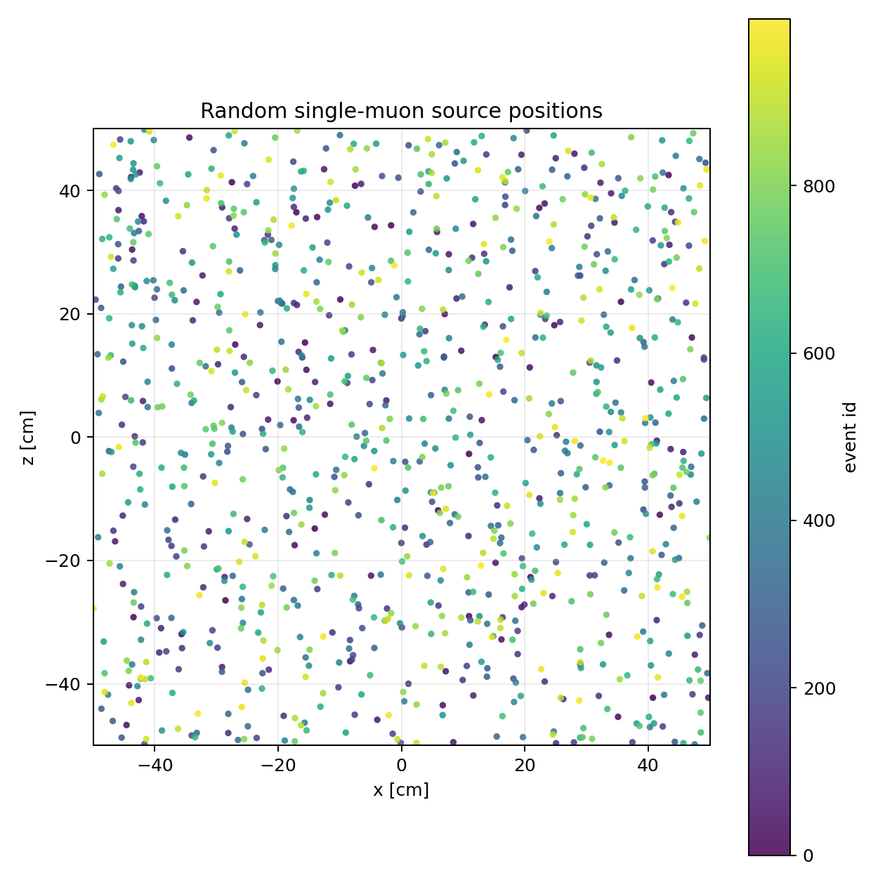
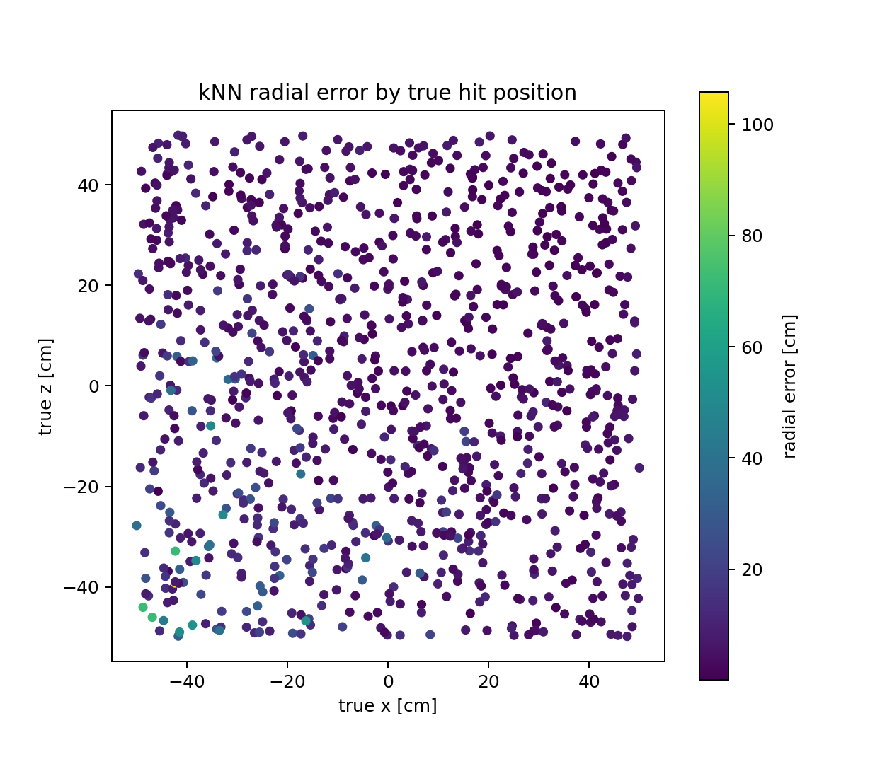
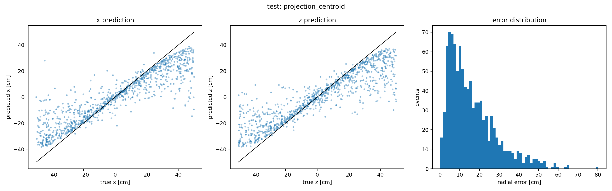
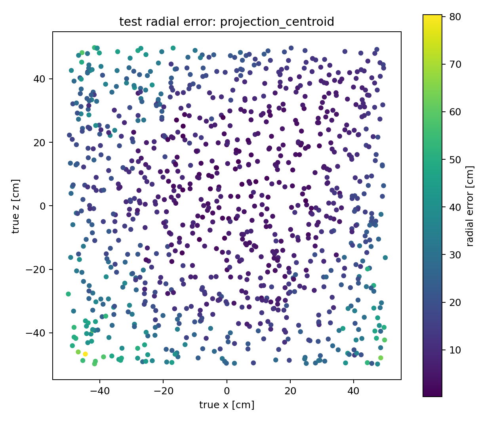

# SiPM Muon Position Reconstruction Report

## Scope

This report summarizes the SiPM reconstruction work from this Codex session, focusing on two methods:

- k-nearest neighbors using the 32 SiPM count vector.
- A simple projection centroid baseline.

Random forest and gradient boosting were also explored during the session, but they are not discussed here because this report is intended to compare the simple baseline against the first useful nonparametric method.

## Simulation Data

The reconstruction uses Geant4 single-muon simulations. Each event is converted into a 32-component feature vector:

- `sipm_100` to `sipm_115`
- `sipm_300` to `sipm_315`

Each value is the count of unique WLS photons detected by that SiPM for one event.

### Training Sample

The training sample comes from the fixed-position muon scan:

- Macro: `macros/muon_scan.mac`
- Converted data folder: `analysis/sipm_reconstruction_session/training_scan_data_1024`
- Number of scan positions: 1024
- Each run corresponds to a known fixed muon source position.
- Each run contains repeated single-muon events at that same position.

This sample is used as the reference library for the kNN method. The true hit position for each training run is taken from the known scan position in the macro.

The converted per-run CSV files are generated data products and are kept outside Git. In this working tree they live under the path above, but they should be saved/restored separately from the source repository.

### Random Test Sample

The test sample comes from a random-position muon scan:

- Generator: `macros/generate_random_muon_scan.py`
- Macro: `macros/random_muon_scan.mac`
- Position table: `macros/random_muon_scan_positions.csv`
- Random seed: `20260504`
- Converted data folder: `analysis/sipm_reconstruction_session/test_scan_data_1000`
- Number of test positions/events: 1000

The random positions were generated uniformly over the detector face. This is the real test of interpolation: the test hits are not restricted to the 1024 fixed scan locations used for training.

The converted random-test CSV files and detailed prediction CSVs are also kept outside Git. The compact summary tables and plots are retained in this report package.



During the session, the Geant4 CSV output naming was also fixed so that multi-threaded output files preserve the global run number. After that fix, the random test files could be matched to their generated positions by run id.

## Data Preparation

The raw Geant4 CSV files are thread-split hit files. The conversion pipeline:

- reads the raw `MUON-run*_nt_hits_t*.csv` files,
- groups hits by event,
- counts unique WLS photons per SiPM,
- writes one compact CSV per run/event sample.

The main converter is:

`scripts/unique_wls_sipm_counts_pipeline.py`

The random test preparation script is:

`scripts/prepare_random_test_scan_data.py`

## Method 1: kNN Event Library

The kNN method treats each event as a point in a 32-dimensional SiPM-count space. For a new random test event:

1. Build its 32-value SiPM count vector.
2. Compare it to the library of training events.
3. Find the nearest training examples by Euclidean distance.
4. Predict the hit position from the known positions of those neighbors.

The best kNN configuration found in the sweep was:

- Reference: individual training events, not averaged templates.
- Distance: Euclidean distance on raw SiPM counts.
- `k = 48`
- Neighbor weighting: inverse-square distance weighting.

This means closer training events contribute more strongly to the predicted position.

## Method 2: Projection Centroid

The projection centroid is a physics-motivated baseline. It does not train a model.

The 32 SiPM channels are treated as two 1D projections:

- `sipm_100` to `sipm_115` estimate the x coordinate.
- `sipm_300` to `sipm_315` estimate the z coordinate.

For each projection, the coordinate is computed as a weighted average:

```text
predicted position = sum(sipm_position * sipm_count) / sum(sipm_count)
```

This method is simple and useful as a sanity check, but it assumes the detected light distribution maps cleanly onto the hit position. In this simulation it performs much worse than kNN.

## Results On 1000 Random Test Hits

| Method | Mean radial error | Median radial error | 68% radial error | 95% radial error | sigma x | sigma z |
|---|---:|---:|---:|---:|---:|---:|
| kNN event library | 4.30 cm | 2.87 cm | 4.40 cm | 13.73 cm | 4.13 cm | 4.38 cm |
| Projection centroid | 16.24 cm | 12.96 cm | 19.09 cm | 41.50 cm | 14.22 cm | 14.56 cm |

The kNN method is substantially better than the projection centroid on this random-position test sample.


The kNN hit map from the original kNN notebook is also included:



The projection centroid plots are included here:





## Interpretation

The centroid baseline is useful because it is transparent and does not depend on a training set. However, it throws away too much information. It compresses the SiPM response into two independent weighted averages, so it cannot easily account for asymmetric light sharing, edge effects, or nonlinear detector response.

kNN keeps the full 32-channel pattern. It effectively asks: "Which simulated training events produced the most similar SiPM light pattern?" Because the training library contains many repeated events at known scan positions, kNN can use the full event-to-event distribution rather than only an average response.

The current kNN result is still above the target of beating roughly 2 cm one-sigma deviation, but it is clearly better than the naive centroid on the random test set. The remaining error suggests that the next useful step is either improving the representation and calibration, or moving to a more structured regression model after preserving the full 32-channel event information.

## Training Statistics Check

To test whether the kNN result depends strongly on having 100 simulated events at each training position, the event-library kNN sweep was repeated using only the first 10 events from each of the 1024 scan positions. The same 1000 random test hits were used.

| Training events per position | Best k | Mean radial error | Median radial error | 68% radial error | 95% radial error |
|---:|---:|---:|---:|---:|---:|
| 100 | 48 | 4.30 cm | 2.87 cm | 4.40 cm | 13.73 cm |
| 10 | 24 | 4.48 cm | 3.17 cm | 4.75 cm | 13.10 cm |

Using only 10 events per scan position makes the 68% radial error worse by about 0.35 cm, or roughly 8%. This means the repeated events do help, but the reconstruction accuracy is not dominated by having all 100 events per position. Much of the performance is coming from the 1024-position spatial coverage and the full 32-channel SiPM pattern.


This check used the first 10 events from each run deterministically. A more complete version would repeat the test with several random 10-event subsets per position and quote the spread.

## New Geometry Check: No Stubs, Alternating SiPM Sides

A second reconstruction check was run after changing the geometry to remove the stubs and place the SiPMs directly on the fiber ends, with alternating positive/negative SiPM sides for each fiber set. This test is separate from the original results above.

The training sample for this check used the May 7 fixed scan output:

- Raw training folder: `build/1024_muon_scan_may7_2026`
- Converted training folder: `analysis/sipm_reconstruction_session/new_geometry_may7/training_scan_data_1024`
- Number of scan positions: 1024
- Events per position: 10
- File layout: old style, one Geant4 run per scan position.

The random test sample used the new one-run `ADD_SCAN` output:

- Raw test folder: `new_build/output`
- Converted test folder: `analysis/sipm_reconstruction_session/new_geometry_may7/test_scan_data_1000`
- Number of random test events: 1000
- File layout: one Geant4 run split across worker-thread ntuple files.

For the `ADD_SCAN` output, the event-to-position mapping is no longer inferred from the output filename. Instead, it is read from the source-truth ntuple files, `MUON-run0_nt_source_t*.csv`. Each test event has an `EventID`, `SourceIndex`, `SourceCycle`, and true source position. The conversion script for this format is:

`scripts/prepare_add_scan_test_data.py`

### New Geometry Results

| Method | Mean radial error | Median radial error | 68% radial error | 95% radial error | sigma x | sigma z |
|---|---:|---:|---:|---:|---:|---:|
| kNN event library | 2.58 cm | 2.25 cm | 2.99 cm | 5.60 cm | 2.09 cm | 2.21 cm |
| Projection centroid | 10.61 cm | 9.62 cm | 12.66 cm | 22.04 cm | 8.70 cm | 8.55 cm |

The best kNN configuration for this new-geometry check was:

- Reference: individual training events.
- Distance: Euclidean distance after L1 normalization.
- `k = 12`
- Neighbor weighting: inverse-square distance weighting.

This is a major improvement over the earlier kNN result. The 68% radial error improves from 4.40 cm to 2.99 cm, and the 95% radial error improves from 13.73 cm to 5.60 cm. The projection centroid remains much worse than kNN. The all-32-channel physical centroid is not appropriate for this alternating-SiPM geometry because the old fixed-edge SiPM-position assumption no longer matches the detector layout.


### Dense 10000-Position Training Check

A denser fixed-position training set was also generated for the new geometry:

- Position macro: `macros/muon_scan_10000_1event_positions.mac`
- One-run driver macro: `macros/muon_scan_one_run_10000_1event.mac`
- Raw training folder: `new_build/10000_training_scan_may7`
- Converted training folder: `analysis/sipm_reconstruction_session/new_geometry_may7/training_scan_data_10000_1event`
- Number of scan positions: 10000
- Events per position: 1
- Grid: 100 by 100, with about 0.99 cm spacing in x and z.

This uses the `ADD_SCAN` source-truth output, so the training labels come from `SourceIndex` and the source position columns rather than from separate run numbers. The same 1000 random ADD_SCAN test events were used.

| Training library | Best kNN setting | Mean radial error | Median radial error | 68% radial error | 95% radial error | sigma x | sigma z |
|---|---|---:|---:|---:|---:|---:|---:|
| 1024 positions x 10 events | k=12, euclidean, L1, inverse-square | 2.58 cm | 2.25 cm | 2.99 cm | 5.60 cm | 2.09 cm | 2.21 cm |
| 10000 positions x 1 event | k=16, euclidean, L1, inverse | 2.54 cm | 2.26 cm | 2.95 cm | 5.50 cm | 2.03 cm | 2.23 cm |

The denser 10000-position library improves the result only slightly: the 68% radial error changes from 2.99 cm to 2.95 cm. This suggests that simply making the grid much denser is not enough to dramatically improve single-event reconstruction. The remaining error is likely coming from event-to-event photon statistics, detector response degeneracy, or the limited information content of a single 32-channel hit pattern.


## Packaged Session Artifacts

This folder collects the SiPM reconstruction work touched during the session:

- `scripts/`: conversion, test-data preparation, kNN sweep, centroid baseline, and report plotting code.
- `notebooks/`: random-position plotting, kNN, centroid, forest, gradient boosting, and comparison notebooks.
- `results/`: compact summary CSVs tracked in Git; detailed generated prediction CSVs are saved separately.
- `figures/`: plots used in this report plus exploratory model plots.
- `training_scan_data_1024/`: converted fixed-position training data, stored locally/saved separately.
- `test_scan_data_1000/`: converted random-position test data, stored locally/saved separately.
- `data_manifests/`: manifest for matching random test events to generated positions.
- `new_geometry_may7/`: separate new-geometry reconstruction check using May 7 fixed-scan training data and one-run `ADD_SCAN` random test data.

The Geant4 macro sources remain in the repo-level `macros/` folder:

- `macros/muon_scan.mac`
- `macros/generate_muon_scan.py`
- `macros/random_muon_scan.mac`
- `macros/generate_random_muon_scan.py`
- `macros/random_muon_scan_positions.csv`

The primary report outputs are:

- `sipm_reconstruction_report.md`
- `figures/knn_centroid_comparison.png`
- `results/knn_centroid_summary.csv`
